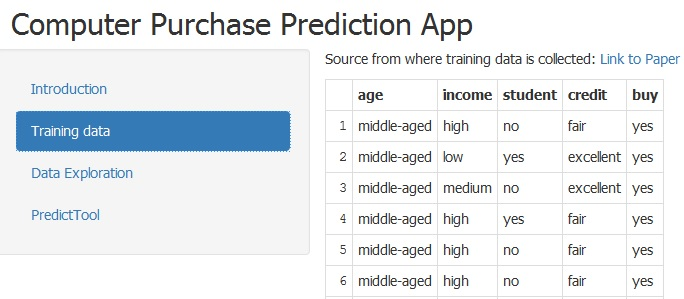

Predict Computer Purchase App
========================================================
author: Anitha Veeramani
date: 2015-11-20
transition: rotate

<small> App which help to predict whether the user with input features will buy computer or not
</small>


Dataset Exploration
========================================================



```
Dimension:  42 5
```

```
Features:  age income student credit buy
```

Feature Analysis
========================================================
 
***
 


Computer Purchase Prediction App
========================================================


<small>ShinyApp UI where we can input feature of the person such as **Age, Income , Credit and Student** and Predict whether he will buy computer.</small>


Conclusion
========================================================
- You can access the shinyApp from this URL: https://anithai2r.shinyapps.io/BuyComputerApp

- The server.R and ui.R are available at Github: https://github.com/anitha2/BuyComputerApp.git

- This presentation http://rpubs.com/anitha2/BuyComputerApp
